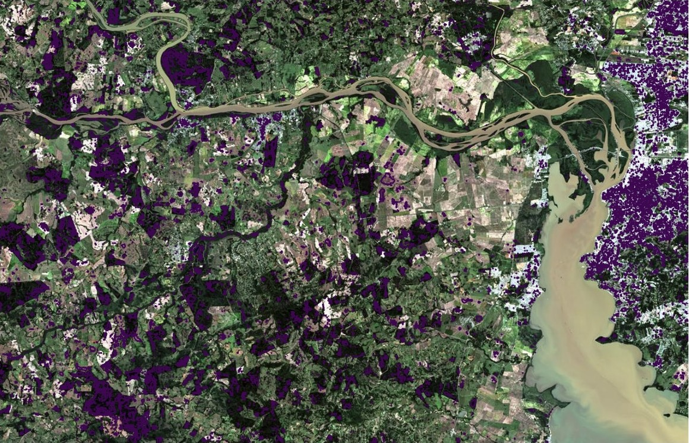
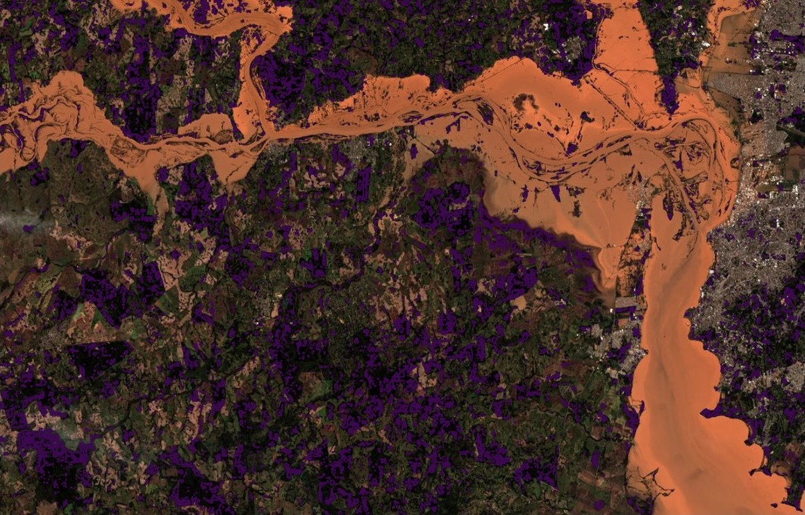
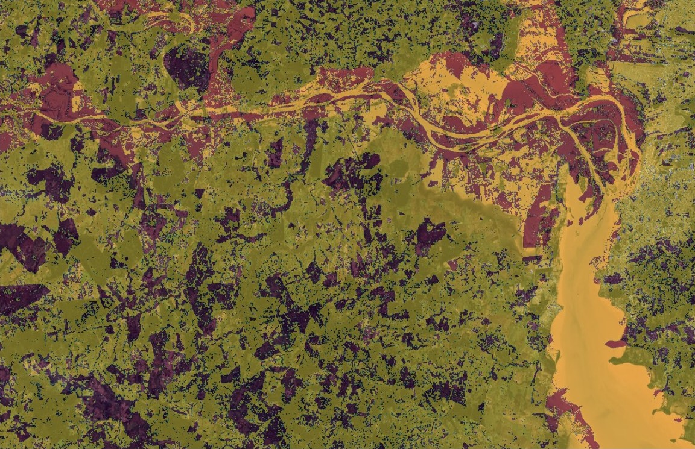

# Zetta Lab 2025 - Desafio 1 (Filtro Inicial)

Esse desafio iniciou no dia 09/10/2025 e a data de entrega foi 28/10/2025.

> Solução individual desenvolvida para o Desafio I da 1ª fase do **Programa Zetta Lab**, iniciativa da **Agência Zetta** em parceria com a **Universidade Federal de Lavras (UFLA)**.

---

## Sobre o Desafio

O desafio era desenvolver a capacidade de associar notícias a evidências geográficas, trabalhar com séries temporais e quantificar impactos ambientais pontuais. A partir de algum evento ambiental extremo recente (ex: uma enchente, incêndio florestal, deslizamento de terra etc.) reportado na mídia, seguir as seguintes ações:
1. Localizar o evento em imagens de satélite de antes e depois do ocorrido.
2. Delimitar a área afetada em ambas as imagens.
3. Criar um layout de mapa que compare as duas situações (antes e depois) e calcular a
extensão aproximada da área impactada.
4. Produzir um relatório de uma página relacionando o evento mapeado com fatores naturais
e antrópicos

Eu decidi fazer uma análise das enchentes em Canoas (RS) por meio de sensoriamento remoto, comparando imagens de satélite do período anterior e posterior ao evento climático extremo de abril/maio de 2024.

---

## Metodologia e Resultados
* **Satélite:** Sentinel-2 (via plataforma *EOS LandViewer*).
* **Datas analisadas:** 
  * **Antes:** 21/04/2024
  * **Depois:** 06/05/2024
* **Técnica:** Delimitação e análise das variações na reflectância da superfície com base no contraste espectral entre as datas.
* **Resolução Espacial:** 10 metros por pixel.
* **Resultado:** Área total inundada estimada em **~6,87 km²**.

---

## Comparativo Espectral

| Antes (21/04/2024) | Depois (06/05/2024) | Área Alagada |
| :---: | :---: | :---: |
|  |  |  |

---

## Estrutura do Repositório
* `desafio1-zettalab.pdf` - Relatório final em PDF.
* `desafio1-zettalab.qmd` - Código-fonte do relatório em Quarto.
* `antes.jpg` - Imagem Sentinel-2 pré-enchente.
* `depois.jpg` - Imagem Sentinel-2 pós-enchente.
* `diferenca.jpg` - Mapeamento da área afetada por diferença espectral.

---

## Como Reproduzir

### Pré-requisitos
* [Quarto](https://quarto.org/) instalado.
* Compilador LaTeX para geração do PDF.

### Execução
Clone o repositório e execute o comando abaixo no terminal:

```bash
quarto render desafio1-zettalab.qmd
```
* Precisa ajustar o caminho das imagens

Desenvolvido para o Programa Zetta Lab 2025 | Agência Zetta - UFLA
